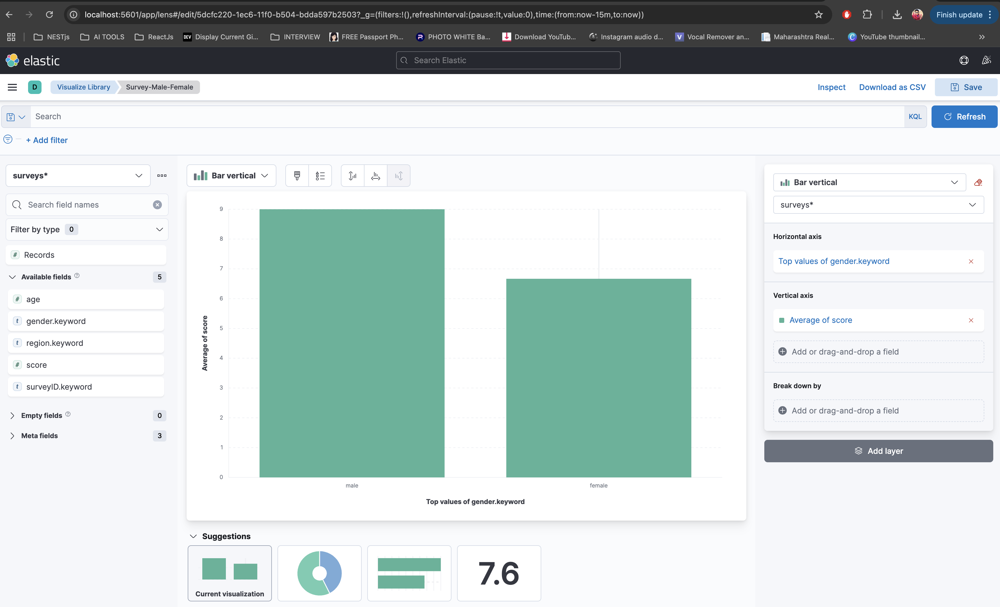

# Survey Management API (Dropwizard + Elasticsearch + Kibana + Swagger)

This is a Dropwizard-based REST API that accepts survey data, logs it, and stores it in Elasticsearch. Kibana is used for real-time visualization, and Swagger UI is bundled for interactive API documentation.

---

## 🛠 Technologies Used

- Java 17
- Dropwizard 4.0.3
- Elasticsearch 7.17.17
- Kibana 7.17.17
- Swagger (OpenAPI 3) - self-hosted UI
- Maven
- Docker & Docker Compose

---

## 📦 Features

- RESTful endpoint `/surveys` that accepts `SurveyData`
- Validates and logs incoming JSON to the console
- Stores each survey entry in Elasticsearch (`surveys` index)
- Visualizes average score per gender using Kibana
- Swagger UI hosted locally for API interaction

---

## 🚀 Getting Started

### 🔧 Prerequisites

- Docker & Docker Compose installed

---

### ▶️ Run the Application

When you run with below command:

```bash
docker-compose up --build
```

You get:

| Service         | URL                                    | Description                          |
|----------------|----------------------------------------|--------------------------------------|
| Dropwizard API | http://localhost:8080                  | Public API, `POST /surveys`          |
| Admin API      | http://localhost:8081                  | Health & metrics (`/healthcheck`)    |
| Elasticsearch  | http://localhost:9200                  | Data store for surveys               |
| Kibana         | http://localhost:5601                  | Dashboard UI to visualize data       |
| Swagger UI     | http://localhost:8080/swagger-ui       | Interactive API testing              |

---
### 🧪 Testing the API

Send a sample survey record with a single‑line `curl`:

```bash
curl -X POST http://localhost:8080/surveys \
     -H "Content-Type: application/json" \
     -d '{"age":29,"gender":"female","region":"APAC","surveyID":"survey-001","score":4}'
```
Before proceeding to Kibana, you should send multiple requests with diffrent genders and scores so that you can see visualization better.
---

### 📊 Kibana Visualization Setup

Once the services are running:

#### 1. Open Kibana
- Visit: [http://localhost:5601](http://localhost:5601)

#### 2. Create Index Pattern
- Go to **“Stack Management” → “Index Patterns”**
- Click **Create index pattern**
- Enter: `surveys*`
- No time field needed → click **Next** → **Create index pattern**

#### 3. Create Visualization
- Go to **Visualize Library → Create visualization → Lens**
- Choose the `surveys*` index pattern
- Drag:
  - `gender` into the **horizontal axis**
  - `score` into the **metrics** area
- Change metric from “Count” to **Average**
- Select **Table** or **Bar Chart** as view

This shows average survey score per gender 🚀

#### 4. Result of Visualization



Now every new survey POST automatically updates the chart in real time.


---

### 🧹 Cleanup

To stop and clean up everything:

```bash
docker-compose down -v
```

This shuts down containers and removes volumes (including Elasticsearch data).

---

### 📁 Folder Structure

```bash
dropwizard-surveyApp/
├── src/                      # Java source code (Dropwizard app)
├── swagger-ui/              # Swagger UI static files
├── config.yml               # Dropwizard config
├── Dockerfile               # App + Swagger UI bundle
├── docker-compose.yml       # Compose setup for app + ES + Kibana
├── pom.xml                  # Maven build
└── README.md                # You're here :)
```
